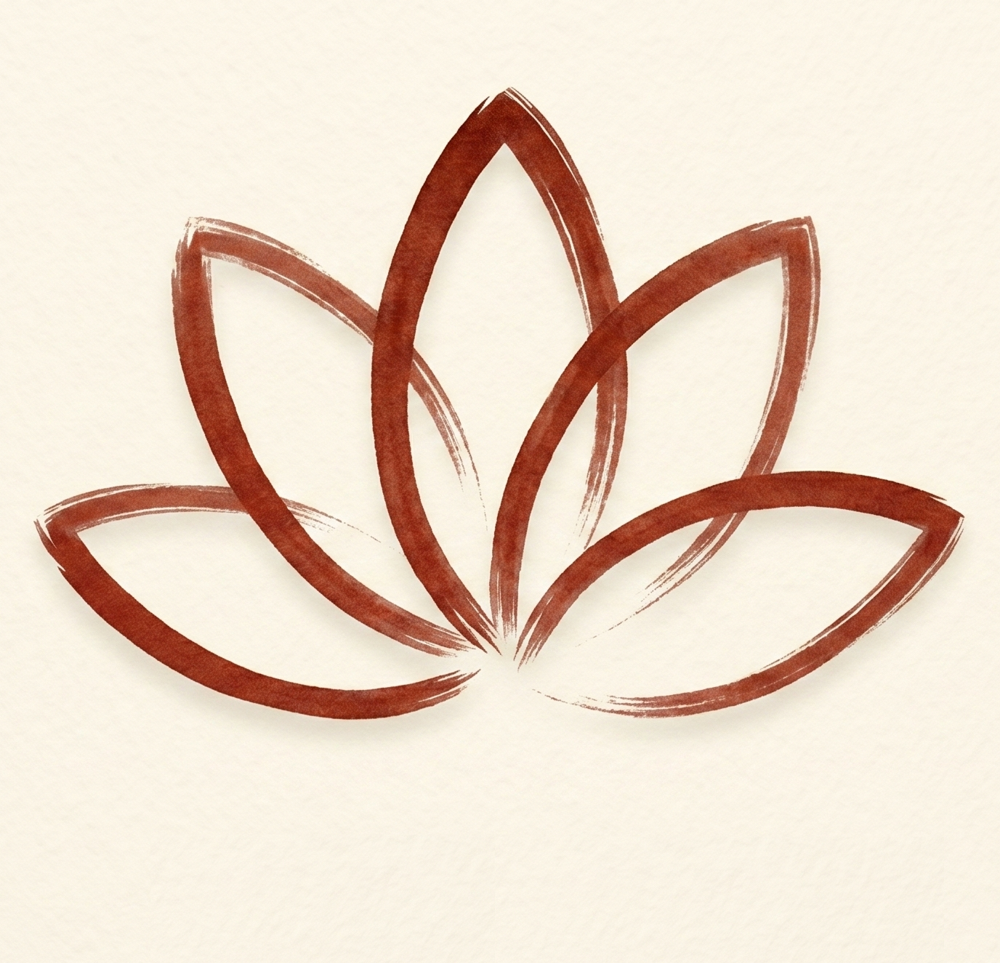

# Mahu

**A calm macOS reminder to look away before your eyes get tired.**

Mahu sits quietly in your menu bar and helps you follow the 20-20-20 rule: work for a while, then take a short visual break. When it is time to rest, Mahu gently covers your screens with a minimal fullscreen break reminder.

  

## Why Mahu?

Modern work makes it too easy to stare at a display for hours. Mahu is intentionally small and focused: no dashboards, no productivity pressure, no gamification — just a clear reminder to pause and look away.

## Highlights

- **Menu-bar only** — stays out of your Dock and out of your way.
- **20-20-20 by default** — a sensible break rhythm from the first launch.
- **Fullscreen break overlay** — appears across active displays so the reminder is hard to miss.
- **Skip when needed** — keep control when a break would interrupt something important.
- **Pause and resume** — temporarily stop reminders whenever you need uninterrupted focus.
- **Sleep and lock aware** — avoids counting hidden locked/sleep time as real work or break time.
- **Minimal, calm design** — a soft background image with readable overlay text and no noisy interruptions.

## How it feels

Mahu is designed for people who want healthier screen habits without installing a heavy productivity system.

You start it, it lives in the menu bar, and it reminds you when it is time to step back. If you lock your Mac, close the lid, or walk away, Mahu treats that as real away time instead of surprising you with stale breaks later.

## Good fit if you want

- a native macOS break reminder;
- a lightweight eye-rest helper;
- a menu-bar app with no Dock icon;
- fullscreen reminders across multiple displays;
- something simple enough to trust and ignore until it matters.

## Current status

Mahu is an early native macOS app. It already includes the core reminder flow, break overlay, menu-bar controls, tests, and local build workflow.

Some release tasks are still future work: signing, notarization, App Store packaging, and additional fullscreen Spaces hardening.

## Build from source

Developer setup, verification commands, project structure, and implementation notes live in [`DEVELOPMENT.md`](DEVELOPMENT.md).

## Design references

Mahu is inspired by the simplicity of apps like:

- [Intermission - Breaks for eyes](https://apps.apple.com/us/app/intermission-breaks-for-eyes/id1439431081?mt=12)
- [Lumo - Eye strain 20-20-20](https://apps.apple.com/dz/app/lumo-eye-strain-20-20-20/id6758925986)

They are references for calm break-reminder behavior, not feature-parity targets.
